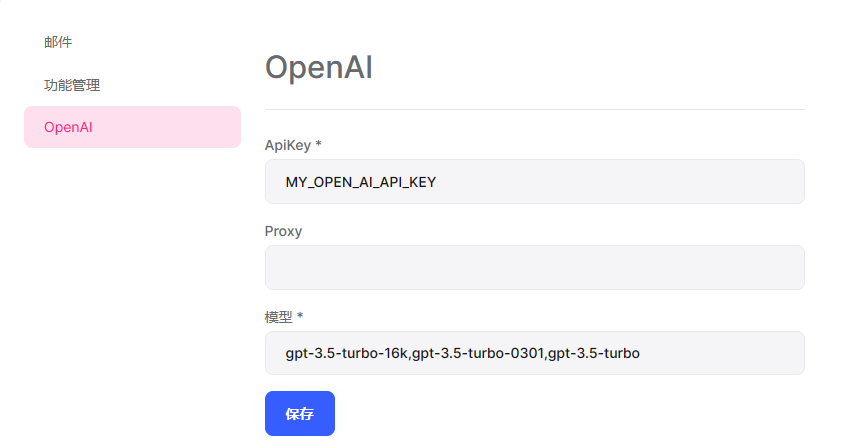
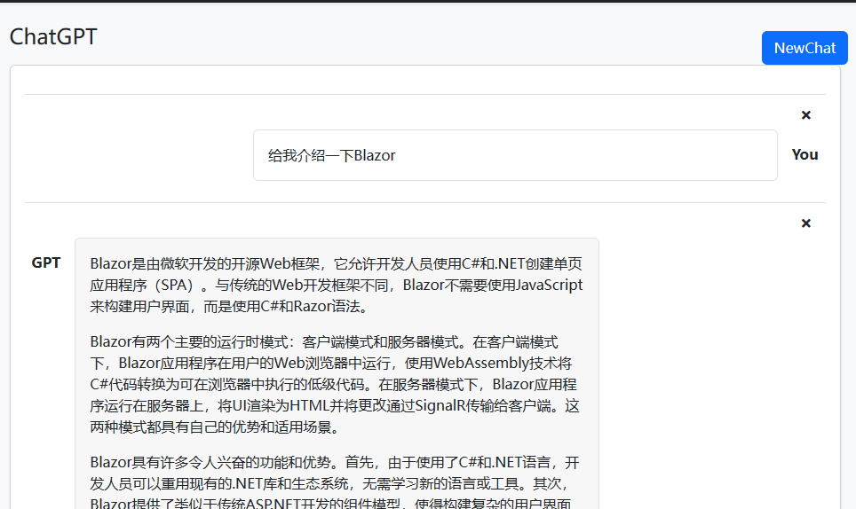
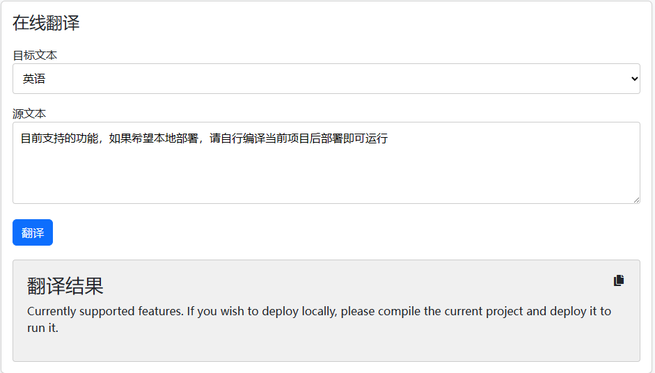
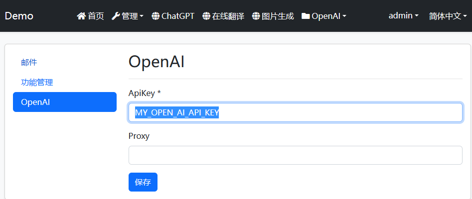

# OpenAI模块演示项目
目前支持的功能，如果希望本地部署，请自行编译当前项目后部署即可运行
## 7.3.1更新说明
* 解决ChatGpt页面打开异常问题
## 7.3.0更新说明
* ChatGpt模型支持在设置中修改


## 主要功能
* ChatGpt

* 在线翻译

* 图片生成

* 支持修改ApiKey和Proxy


demo项目登录账号为admin，密码1q2w3E*

## 准备工作

### 1.安装 NuGet packages.(目前前端只有Blazor，MVC版本后续会推出)
  * JS.Abp.OpenAI.Application
  * JS.Abp.OpenAI.Application.Contracts
  * JS.Abp.OpenAI.Domain
  * JS.Abp.OpenAI.Domain.Shared
  * JS.Abp.OpenAI.EntityFrameworkCore
  * JS.Abp.OpenAI.HttpApi
  * JS.Abp.OpenAI.HttpApi.Client
选装
  * JS.Abp.OpenAI.Blazor.Server
  * JS.Abp.OpenAI.Blazor.WebAssembly
  
### 2.添加“依赖”属性以配置模块
 * [DependsOn(typeof(OpenAIApplicationModule))]
 * [DependsOn(typeof(OpenAIApplicationContractsModule))]
 * [DependsOn(typeof(OpenAIDomainModule))]
 * [DependsOn(typeof(OpenAIDomainSharedModule))]
 * [DependsOn(typeof(OpenAIEntityFrameworkCoreModule))]
 * [DependsOn(typeof(OpenAIHttpApiModule))]
 * [DependsOn(typeof(OpenAIHttpApiClientModule))]
 * [DependsOn(typeof(OpenAIBlazorModule))]
 * [DependsOn(typeof(OpenAIBlazorServerModule))]
 * [DependsOn(typeof(OpenAIBlazorWebAssemblyModule))]

### 3. 在你的Dbcontext添加 ` builder.ConfigureOpenAI();`

### 4. 添加 EF Core 迁移并更新数据库.
在 YourProject.EntityFrameworkCore 项目的目录中打开命令行终端，然后键入以下命令:

````bash
> dotnet ef migrations add Added_OpenAI
````
````bash
> dotnet ef database update
````

### 5. 配置你的ApiKey
ApiKey已经支持使用Settings配置，首次使用请配置Key和Proxy


## 注意事项
* 有部分地区无法访问api.openai.com:443，这一问题请自行解决
* 不登录也可以使用，但是不会保留历史记录
* 当前模块已经在仓储进行过滤，只能查看当前用户历史记录

### 感谢
本模块使用了第三方库，更多的信息可以到下述仓库进行查看
https://github.com/betalgo/openai
